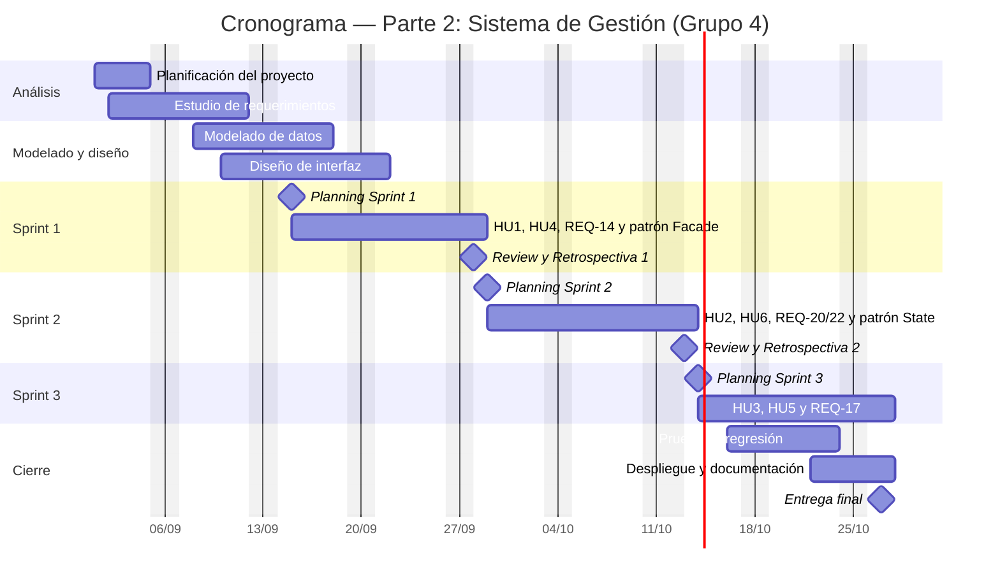
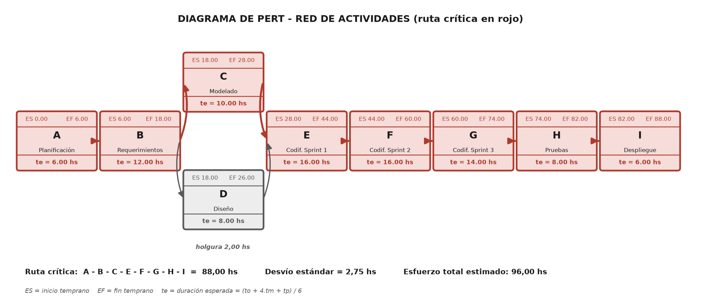
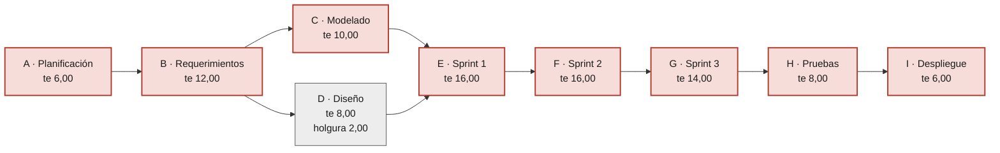

# Plan de Trabajo — Proyecto

**Centro Educativo "Educar para Transformar" — Sistema de Gestión**
Metodología de Sistemas II · UTN FRRe · TUP 2026
Equipo: **Grupo 4** — Cerqueiro, Gonzalo · Fernández, Lautaro

> Este documento sigue la estructura del formulario de plan de trabajo entregado por la
> cátedra. La versión presentada está en
> `Metodología de Sistemas II/PlanDeTrabajo_Metodología2_Grupo4.docx` (fuera del repositorio
> por `.gitignore`); acá vive su conversión a Markdown.

---

## 1. Descripción del proyecto

### Problema

El Centro Educativo *"Educar para Transformar"* es una institución de gestión privada ubicada
en las afueras de Resistencia, con inicio de actividades previsto para **marzo de 2027**.
Necesita automatizar su gestión en tres partes: página web, sistema de gestión y aplicación
móvil.

La **Parte 1 (página web institucional)** se desarrolló y entregó en Metodología de Sistemas I.
Resuelto el canal de comunicación externo, persiste el problema interno: **la información
académica, deportiva y de servicios no está centralizada**. Sin un sistema de gestión, la
matrícula, las calificaciones, la asistencia, los legajos de personal y las inscripciones a
deportes, transporte y comedor se administran de forma dispersa, lo que impide que la
información sea consistente, esté actualizada y pueda consultarse según los permisos de cada rol.

### Objetivo general

Desarrollar un sistema que permita gestionar de manera integrada la información académica,
deportiva y de servicios de los alumnos, facilitando el trabajo de docentes, padres y personal
administrativo, garantizando que la información esté actualizada, sea consistente y pueda
consultarse de acuerdo con los permisos correspondientes.

### Módulos de esta etapa

| Módulo | Alcance |
|---|---|
| Módulo Alumnos | Legajo, DNI, nombre, apellido, fecha de nacimiento, domicilio, teléfono, correo, nivel educativo, curso y estado. |
| Módulo Profesores | Legajo, DNI, nombre, apellido, especialidad, correo, teléfono, estado, materias a cargo y cursos/niveles. |
| Módulo Administración | Alumnos, profesores, niveles, cursos, materias, deportes, horarios, inscripciones, transporte, comedor, usuarios y permisos, más todos los reportes. |

### Clasificación de los requerimientos

Ver [Unidad 1 — Parte 1](../01-unidad-1/01-parte-1-requerimientos/README.md), apartados 1 y 2:
requerimientos REQ-13 a REQ-22, clasificación del sistema de información, arquitectura de la
información y arquitectura de software.

---

## 2. Objetivos SMART

### OE-1 — Entrega funcional del Sistema de Gestión

Desarrollar y desplegar en el entorno de pruebas las seis Historias de Usuario del backlog del
producto (HU1 a HU6), equivalentes a 31 puntos de historia, distribuidas en tres sprints de dos
semanas, cumpliendo el 100 % de sus criterios de aceptación, antes del 27 de octubre de 2026.

| Criterio | Justificación |
|---|---|
| Específico | Seis HU identificadas y acotadas, con sus tareas técnicas y criterios de aceptación ya redactados en el backlog. |
| Medible | 6 HU cerradas sobre 6 comprometidas; 31 puntos de historia completados; % de criterios de aceptación cumplidos. |
| Alcanzable | 96 hs de equipo disponibles (2 × 6 h × 8 semanas) frente a una ruta crítica estimada por PERT en 88 hs. |
| Relevante | Es el entregable central de la Parte 2 y la base técnica de la Parte 3 (app móvil). |
| Temporal | 27 de octubre de 2026, fecha de entrega del proyecto completo. |

### OE-2 — Seguridad y control de acceso por rol

Implementar y verificar el control de acceso de los seis roles del sistema (Administrador,
Autoridad, Docente, Personal, Padre y Estudiante) en las dos capas exigidas —políticas RLS en
PostgreSQL y verificación en la interfaz—, alcanzando cero accesos indebidos sobre el total de
casos de prueba de permisos ejecutados, al cierre del Sprint 2 el 13 de octubre de 2026.

| Criterio | Justificación |
|---|---|
| Específico | Seis roles concretos (ver `src/types/roles.js`) y dos capas de verificación determinadas. |
| Medible | 0 accesos indebidos sobre el total de casos de prueba; una política RLS activa por tabla nueva. |
| Alcanzable | El enumerado de roles, el `AuthContext` y las rutas protegidas ya existen desde la Parte 1. |
| Relevante | La cátedra evalúa que cada rol acceda solo a lo suyo; el enunciado exige que un padre gestione solo lo de sus hijos. |
| Temporal | 13 de octubre de 2026, cierre del Sprint 2. |

### OE-3 — Respuesta al desafío del enunciado

Incorporar los cuatro requerimientos extra (REQ-14, REQ-17, REQ-20 y REQ-22) consumiendo como
máximo el 25 % de la capacidad de cada sprint —entre 5 y 6 puntos— sin desplazar ninguna
Historia de Usuario comprometida, antes del 13 de octubre de 2026.

| Criterio | Justificación |
|---|---|
| Específico | Cuatro requerimientos que exceden las seis HU y no formaban parte del alcance original. |
| Medible | 4 requerimientos implementados; consumo ≤ 25 % de la capacidad; 0 HU desplazadas. |
| Alcanzable | Se apoyan en módulos que ya se construyen: REQ-14 es precondición de HU2 y HU4, REQ-17 se apoya en HU2, REQ-20 comparte módulo con HU6. |
| Relevante | El enunciado pide agregar al menos una funcionalidad de valor no contemplada inicialmente. |
| Temporal | 13 de octubre de 2026. |

### OE-4 — Trazabilidad del trabajo del equipo y de cada integrante

Registrar el 100 % de las Historias de Usuario como issues en el tablero Kanban de GitHub
Projects y mantener la bitácora del equipo y la de cada integrante, con al menos un commit
identificado por HU en el scope del mensaje, durante las ocho semanas del proyecto
(1 de septiembre al 27 de octubre de 2026).

| Criterio | Justificación |
|---|---|
| Específico | Seis issues en el tablero, dos bitácoras individuales y una del equipo, y convención de commits con la HU en el scope. |
| Medible | 6 de 6 HU como issue; % de commits con scope válido; 2 bitácoras individuales sostenidas. |
| Alcanzable | GitHub Projects e Issues están en el mismo repositorio; la convención de commits ya está documentada en `CLAUDE.md`. |
| Relevante | La cátedra pide mostrar en la presentación final la bitácora del tablero del equipo y la de cada integrante. |
| Temporal | Del 1 de septiembre al 27 de octubre de 2026, en forma continua. |

### OE-5 — Calidad del incremento entregado

Cumplir los seis puntos de la Definition of Done en el 100 % de las Historias de Usuario
cerradas, incluyendo la revisión cruzada por Pull Request del otro integrante, antes de la
entrega final del 27 de octubre de 2026.

| Criterio | Justificación |
|---|---|
| Específico | Seis condiciones de la DoD, entre ellas el code review cruzado y la verificación de permisos por rol. |
| Medible | 6 de 6 puntos de la DoD por HU cerrada; 100 % de PR con revisión aprobada. |
| Alcanzable | En un equipo de dos, cada PR tiene un revisor natural. |
| Relevante | Sin revisión cruzada una HU no se considera terminada: es la política de calidad acordada. |
| Temporal | 27 de octubre de 2026. |

### OE-6 — Aplicación de patrones de diseño

Aplicar los tres patrones de diseño seleccionados —Singleton, Facade y State, uno por cada
tipo— en los módulos del Sistema de Gestión, dejando cero accesos directos a la base de datos
desde la capa de presentación y cero transiciones de estado sin validar, antes del cierre del
Sprint 3 el 27 de octubre de 2026.

| Criterio | Justificación |
|---|---|
| Específico | Tres patrones concretos con ubicación definida: Singleton en el cliente de datos, Facade en la capa de servicios y State en el ciclo de vida de matrículas y postulaciones. |
| Medible | 0 archivos de presentación que importen el cliente de base de datos (hoy son 14); 0 transiciones de estado sin validación; 3 de 3 patrones documentados. |
| Alcanzable | El Singleton ya está en uso desde la Parte 1 y la Facade existe parcialmente en los hooks: se trata de completarlos, no de construirlos de cero. |
| Relevante | Corresponde a la Unidad 2 y resuelve dos debilidades reales del código actual. |
| Temporal | Facade en el Sprint 1 (28 de septiembre) y State en el Sprint 2 (13 de octubre); verificación final en el Sprint 3. |

---

## 3. Patrones de diseño aplicados

Se seleccionó un patrón de cada tipo. El criterio no fue elegir los más conocidos, sino los que
resuelven un problema concreto y verificable del proyecto: dos ya están en uso desde la Parte 1
y el tercero corrige una debilidad detectada al revisar el código.

| Tipo | Patrón | Dónde se aplica | Estado |
|---|---|---|---|
| Creacional | **Singleton** | Cliente de acceso a datos y autenticación — [`src/lib/supabase.js`](../../src/lib/supabase.js) | En uso desde la Parte 1 |
| Estructural | **Facade** | Capa de servicios por módulo — `src/services/` | Parcial: se completa en el Sprint 1 |
| Comportamiento | **State** | Ciclo de vida de matrícula y postulaciones laborales | A implementar en el Sprint 2 |

### Creacional — Singleton

**Problema.** El acceso a la base de datos, la autenticación y el almacenamiento se hacen a
través de un único cliente. Si cada módulo creara el suyo, cada instancia mantendría su propia
sesión y su propio token: el usuario aparecería autenticado en una parte de la aplicación y
anónimo en otra, y las políticas RLS se evaluarían contra identidades distintas.

**Implementación.** El cliente se crea una sola vez en `src/lib/supabase.js` y se exporta esa
instancia. En JavaScript los módulos se evalúan una única vez, por lo que el propio sistema de
módulos garantiza la instancia única, sin constructor privado ni `getInstance()`. Es la forma
idiomática del patrón en este lenguaje.

### Estructural — Facade

**Problema.** Aunque existen hooks que encapsulan el acceso a datos, **catorce archivos de
páginas y componentes importan el cliente de base de datos directamente** y arman sus propias
consultas. La lógica de acceso y las reglas de negocio quedan repartidas por la capa de
presentación.

**Por qué se agrava ahora.** El Sistema de Gestión incorpora reglas que no existían en la web:
validar el rango de una calificación, impedir doble carga de asistencia en la misma fecha,
limitar a dos los deportes por alumno y controlar conflictos de horario. Ninguna puede vivir en
un componente de interfaz.

**Implementación.** Una fachada por módulo en `src/services/`, que expone operaciones del
dominio y esconde consultas, errores y reglas. Regla: ningún componente vuelve a importar el
cliente de base de datos. Beneficio adicional: la Parte 3 (app móvil) consumirá las mismas
fachadas sin duplicar lógica.

### Comportamiento — State

**Problema.** Las solicitudes de inscripción tienen un ciclo de vida (pendiente → en revisión →
aceptada / rechazada) y las postulaciones otro (recibida → en revisión → entrevista →
contratada / descartada). Hoy el cambio de estado **se guarda sin validar la transición**: una
solicitud rechazada puede volver a pendiente, y una pendiente puede pasar directo a aceptada sin
revisión. La base de datos solo verifica que el valor pertenezca al conjunto permitido
([`supabase-schema.sql:67`](../supabase-schema.sql)), no que la transición tenga sentido.

**Por qué es necesario.** REQ-13 exige que una solicitud aprobada se convierta en matrícula y
que ese cambio no se repita; el criterio de aceptación de HU1 dice que la solicitud queda
"matriculado" y no puede volver a matricularse. Sin control de transiciones ese criterio no se
puede verificar. REQ-20 plantea lo mismo para las postulaciones.

**Implementación.** Cada estado se modela como un objeto que declara a qué estados puede pasar y
qué acciones habilita por rol. El cambio pasa por la máquina de estados, que rechaza las
transiciones no contempladas. La misma definición alimenta la interfaz: el desplegable ofrece
solo las transiciones válidas desde el estado actual.

> Los tres se refuerzan: **Singleton** garantiza un único punto de acceso a los datos,
> **Facade** concentra las operaciones de cada módulo y **State** define, dentro de esas
> fachadas, las transiciones que el negocio admite.

---

## 4. Tecnologías

| Categoría | Herramienta | Justificación |
|---|---|---|
| Gestión del proyecto | GitHub Projects (tablero Kanban) + Issues | Vive en el mismo repositorio que el código y el portafolio; una HU = un issue. Se registra la bitácora del equipo y la de cada integrante. |
| Repositorio de software | Git + GitHub | Distribuido; ver [Unidad 1 — Parte 2](../01-unidad-1/02-parte-2-repositorios/README.md). |
| Frontend | React 18 + Vite + React Router v6 | SPA con HMR y rutas protegidas por rol. |
| Estilos | Tailwind CSS v3 | Utilidades, responsive, consistente con la Parte 1. |
| Formularios | React Hook Form + Zod | Validación declarativa en cliente. |
| Backend | Supabase (BaaS) | Auth con JWT, API REST automática y Storage, sin servidor propio. |
| Gestor de base de datos | PostgreSQL (Supabase) | Relacional, con Row Level Security para los permisos por rol. |
| Maquetación | Figma — wireframe → mockup → prototipo | Wireframe de baja fidelidad para acordar la estructura de cada pantalla; mockup con la identidad visual aplicada; prototipo navegable para validar el flujo antes de codificar. |
| Despliegue | Netlify (frontend) + Supabase (backend/BD) | Gratuito, despliegue continuo desde `main`. |

### Arquitectura de software

Cliente-servidor en capas. El gráfico y el detalle de componentes, restricciones y conectores
están en [Unidad 1 — Parte 1, apartado 4](../01-unidad-1/01-parte-1-requerimientos/README.md#5-arquitectura-de-software).

---

## 5. Descripción de las actividades

Capacidad del equipo: **6 horas semanales por integrante**, es decir 12 hs de equipo por
semana y **96 hs en total** a lo largo de las ocho semanas del proyecto.

| Etapa | Tareas | Duración (hs) | Resultados esperados | Responsable |
|---|---|---|---|---|
| Planificación del proyecto | Formación del equipo y reparto por Historia de Usuario. Adopción de Scrum y creación del tablero Kanban. Plan de trabajo y objetivos SMART. | 6 | Plan de trabajo aprobado; tablero Kanban operativo | Ambos |
| Estudio de requerimientos | REQ-13 a REQ-22 aplicando la teoría de requerimientos, clasificación en funcionales y no funcionales, clasificación del SI, arquitecturas, 6 HU con casos de uso y diagramas de secuencia | 12 | TP1 – Parte 1 entregado; backlog priorizado y estimado | Ambos |
| Modelado | Modelo relacional de matrícula, cursos, materias, notas, asistencia, personal, deportes y servicios. Restricciones del enunciado traducidas a claves y disparadores. Scripts SQL idempotentes con RLS. | 10 | DER del Sistema de Gestión y scripts SQL versionados con RLS | Gonzalo (lidera) · revisión de Lautaro |
| Diseño | Wireframes, mockups y prototipo navegable de los módulos Alumnos, Profesores y Administración, reutilizando los componentes de la Parte 1 | 8 | Wireframe, mockup y prototipo validados antes de codificar | Lautaro (lidera) · revisión de Gonzalo |
| Codificación | Sprint 1 (HU1, HU4 + REQ-14, patrón Facade), Sprint 2 (HU2, HU6 + REQ-20, REQ-22, patrón State) y Sprint 3 (HU3, HU5 + REQ-17) | 46 | Incremento funcional por sprint, integrado por PR revisado | Ambos (por HU) |
| Pruebas | Pruebas funcionales sobre criterios de aceptación, de integración entre módulos y de permisos de los seis roles en las dos capas. Pruebas de regresión sobre la web de la Parte 1. | 8 | Casos de prueba documentados; cero accesos indebidos; web sin regresiones | Ambos |
| Implementación o despliegue | Despliegue conjunto de la web y del Sistema de Gestión en Netlify + Supabase, carga de datos de prueba, actualización del portafolio y cierre de la bitácora | 6 | Proyecto completo desplegado y documentación actualizada | Ambos |
| **TOTAL** | | **96** | | |

---

## 6. Cronograma

El proyecto se desarrolla entre el **1 de septiembre y el 27 de octubre de 2026**, en 40 días hábiles.
Los tres sprints son de diez días hábiles y corren **de martes a lunes**, de modo que el Sprint
Planning se hace después de la clase del martes y la Sprint Review el lunes previo a la clase
siguiente.

La entrega del 27 de octubre de 2026 comprende **el proyecto completo**: la página web institucional ya
desplegada (Parte 1) y el Sistema de Gestión desarrollado en esta etapa (Parte 2). A partir de
esa fecha el equipo se centra en la Parte 3 (aplicación móvil).

| N° | Etapa | Inicio | Fin | Días hábiles | Horas |
|---|---|---|---|---|---|
| 1 | Planificación del proyecto | mar 01/09 | vie 04/09 | 4 | 6 |
| 2 | Estudio de requerimientos | mié 02/09 | vie 11/09 | 8 | 12 |
| 3 | Modelado | mar 08/09 | jue 17/09 | 8 | 10 |
| 4 | Diseño | jue 10/09 | lun 21/09 | 8 | 8 |
| 5 | Codificación — Sprint 1 | mar 15/09 | lun 28/09 | 10 | 16 |
| 6 | Codificación — Sprint 2 | mar 29/09 | mar 13/10 | 10 | 16 |
| 7 | Codificación — Sprint 3 | mié 14/10 | mar 27/10 | 10 | 14 |
| 8 | Pruebas | vie 16/10 | vie 23/10 | 6 | 8 |
| 9 | Implementación o despliegue | jue 22/10 | mar 27/10 | 4 | 6 |
| | **TOTAL** | **01/09/2026** | **27/10/2026** | **40** | **96** |

> El **12 de octubre de 2026** es feriado nacional y está descontado del calendario.

Las etapas se solapan deliberadamente: el modelado comienza durante el estudio de requerimientos
y las pruebas se inician antes de que termine la codificación del Sprint 3. Ese solapamiento es
propio de un marco iterativo y es lo que permite sostener el plan dentro de las 96 horas
disponibles.

### Diagrama de Gantt

### Diagrama de PERT

Duración esperada por actividad: **te = (to + 4·tm + tp) / 6**; varianza: **σ² = ((tp − to)/6)²**.
Todas las duraciones están en horas de equipo.

| Act. | Actividad | Prec. | to | tm | tp | te | σ² | ES | EF | LS | LF | Holg. | Crít. |
|---|---|---|---|---|---|---|---|---|---|---|---|---|---|
| A | Planificación del proyecto | — | 4 | 6 | 8 | 6,00 | 0,44 | 0,00 | 6,00 | 0,00 | 6,00 | 0,00 | Sí |
| B | Estudio de requerimientos | A | 10 | 12 | 14 | 12,00 | 0,44 | 6,00 | 18,00 | 6,00 | 18,00 | 0,00 | Sí |
| C | Modelado | B | 8 | 10 | 12 | 10,00 | 0,44 | 18,00 | 28,00 | 18,00 | 28,00 | 0,00 | Sí |
| D | Diseño | B | 6 | 8 | 10 | 8,00 | 0,44 | 18,00 | 26,00 | 20,00 | 28,00 | 2,00 | No |
| E | Codificación — Sprint 1 | C, D | 12 | 16 | 20 | 16,00 | 1,78 | 28,00 | 44,00 | 28,00 | 44,00 | 0,00 | Sí |
| F | Codificación — Sprint 2 | E | 12 | 16 | 20 | 16,00 | 1,78 | 44,00 | 60,00 | 44,00 | 60,00 | 0,00 | Sí |
| G | Codificación — Sprint 3 | F | 10 | 14 | 18 | 14,00 | 1,78 | 60,00 | 74,00 | 60,00 | 74,00 | 0,00 | Sí |
| H | Pruebas | G | 6 | 8 | 10 | 8,00 | 0,44 | 74,00 | 82,00 | 74,00 | 82,00 | 0,00 | Sí |
| I | Implementación o despliegue | H | 4 | 6 | 8 | 6,00 | 0,44 | 82,00 | 88,00 | 82,00 | 88,00 | 0,00 | Sí |
| | **Esfuerzo total estimado** | | | | | **96,00** | | | | | | | |

| Concepto | Valor | Interpretación |
|---|---|---|
| Ruta crítica | A → B → C → E → F → G → H → I | Ocho de las nueve actividades son críticas. |
| Duración de la ruta crítica | 88,00 hs de equipo | Algo más de siete de las ocho semanas disponibles. |
| Esfuerzo total estimado | 96,00 hs de equipo | Coincide con la capacidad planificada. |
| Margen sobre la ruta crítica | 8,00 hs (8,3 %) | Colchón real ante desvíos. |
| Actividad con holgura | D — Diseño: 2,00 hs | Única actividad no crítica; corre en paralelo con el Modelado. |
| Varianza de la ruta crítica | σ² = 7,54 · σ = 2,75 hs | Suma de las varianzas de las actividades críticas. |
| Intervalo de confianza (≈95 %) | entre 82,5 y 93,5 hs | Duración esperada ± 2σ: incluso en el escenario pesimista entra en las 96 hs. |

> **Conclusión.** El margen entre la ruta crítica (88 h) y la capacidad (96 h) es de 8 horas, un
> 8,3 %. Las actividades E, F y G —la codificación de los tres sprints— concentran la
> incertidumbre: son las de mayor varianza (σ² = 1,78 cada una) y suman 46 de las 88 horas de la
> ruta crítica. Por eso las HU de riesgo medio se ubicaron en sprints distintos, se reservó el
> 25 % de la capacidad de cada sprint para los requerimientos extra, y el Sprint 3 se estimó con
> menos carga porque coincide con las pruebas de integración y el despliegue.

---

## 7. Backlog y plan de sprints

Backlog del producto, backlog de cada sprint, criterios de priorización y estimación, plan
día por día y Definition of Done:
**[Unidad 1 — Backlog y Sprints](../01-unidad-1/03-backlog-y-sprints/README.md)**

Resumen:

| Sprint | Fechas | Historias de Usuario | Puntos | Patrón | Objetivo |
|---|---|---|---|---|---|
| Sprint 1 | 15/09 al 28/09 | HU1, HU4 | 11 (+5 de REQ-14) | Facade | Base académica: cursos, matrícula y asistencia |
| Sprint 2 | 29/09 al 13/10 | HU2, HU6 | 10 (+5 de REQ-20 y 22) | State | Calificaciones, legajo de personal y trazabilidad |
| Sprint 3 | 14/10 al 27/10 | HU3, HU5 | 10 (+3 de REQ-17) | — | Comunicados, reportes e integración final |

Cada sprint incorpora **una HU de cada integrante**, de modo que ambos entreguen valor en todas
las iteraciones y la revisión cruzada por Pull Request tenga siempre trabajo del otro.

Velocidad estimada: **~15 puntos por sprint**, de los que se reserva alrededor del 25 % para
los requerimientos extra que no forman parte del cuadro del backlog.

---

## 8. Desafío

El enunciado pide **agregar al menos una funcionalidad que genere valor y que no esté
contemplada inicialmente**.

El equipo responde a ese desafío con los **requerimientos extra**: los que exceden las seis
Historias de Usuario seleccionadas y no formaban parte del enunciado original.

| Req. | Funcionalidad que agrega | Valor que genera |
|---|---|---|
| **REQ-14** | Cursos, materias y asignación docente | Organiza la oferta académica y habilita técnicamente la carga de notas y asistencia. |
| **REQ-17** | Boletines y constancias descargables en PDF | Elimina el circuito administrativo manual para emitir documentación oficial. |
| **REQ-20** | Gestión de postulaciones laborales | Da seguimiento por estado a las postulaciones recibidas desde la web (REQ-08). |
| **REQ-22** | Auditoría y trazabilidad de acciones | Registra las acciones críticas de Administrador y Autoridad con usuario, fecha y acción: seguridad y transparencia administrativa. |

Las seis Historias de Usuario (HU1 a HU6) cubren el resto del alcance comprometido.

Estos requerimientos no integran el cuadro del backlog, pero **sí consumen capacidad del
sprint** y por eso se descuentan de la velocidad estimada — ver
[Backlog, sección 6](../01-unidad-1/03-backlog-y-sprints/README.md#6-requerimientos-extra-considerados-en-la-capacidad).

---

## Antecedente: Parte 1 — Página Web (Metodología de Sistemas I)

| Hito | Fecha |
|---|---|
| Documentación de requerimientos | Abril 2026 |
| Primer commit / inicio del repositorio | 15 de mayo de 2026 |
| Frontend completo (páginas, layout, componentes UI) | 15–17 de mayo de 2026 |
| Integración con base de datos (Supabase, RLS, Storage) | 4–5 de junio de 2026 |
| Testing y correcciones | 29 de mayo – 12 de junio de 2026 |
| Funcionalidades finales y ajustes de UI | 12 de junio de 2026 |
| Entrega final | 19 de junio de 2026 |

Equipo en esa etapa: Cerqueiro Gonzalo, Fernández Lautaro y Hakanson Ian (**Grupo 8 — Zonura**).
