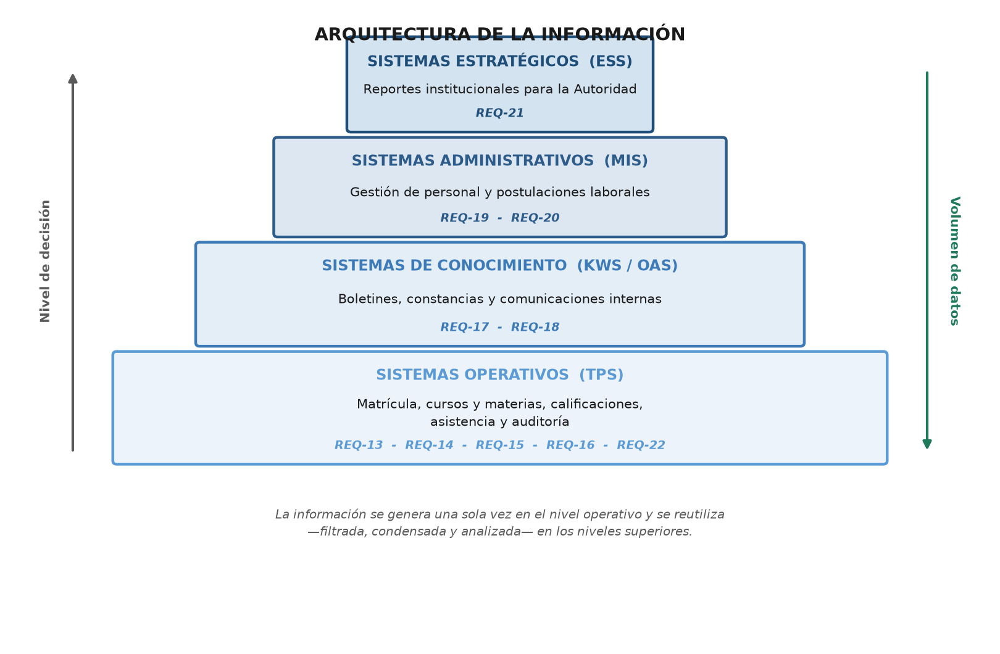
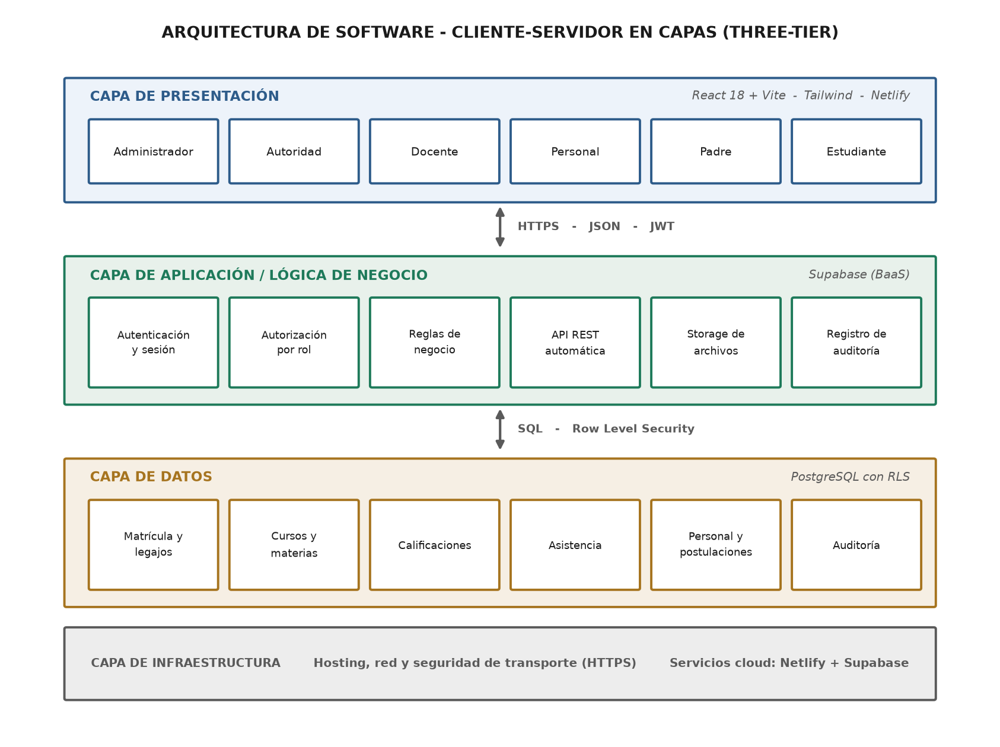
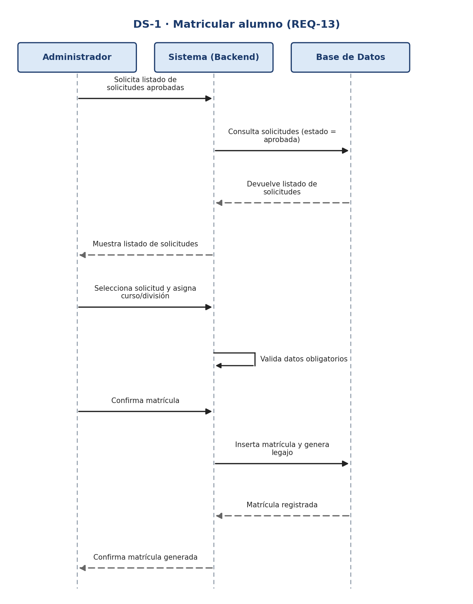
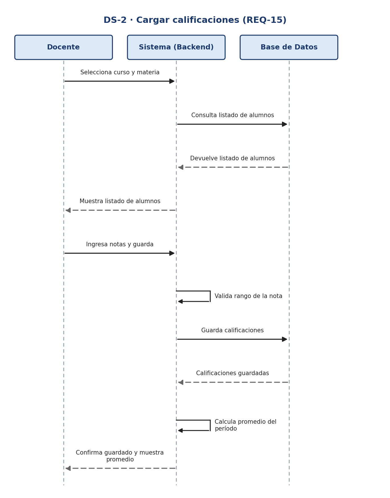
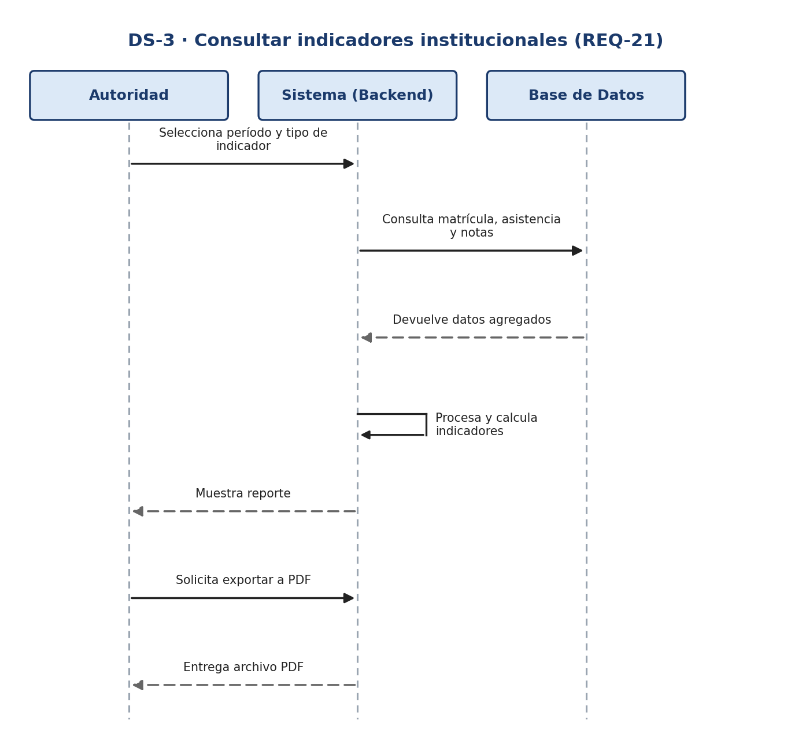
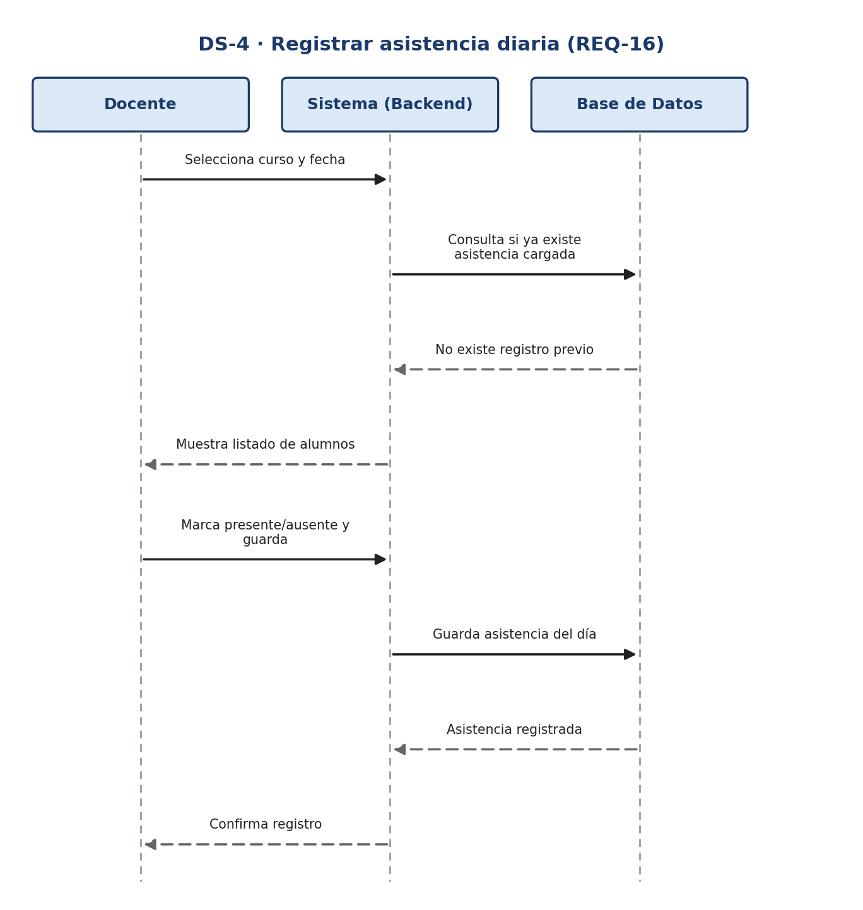
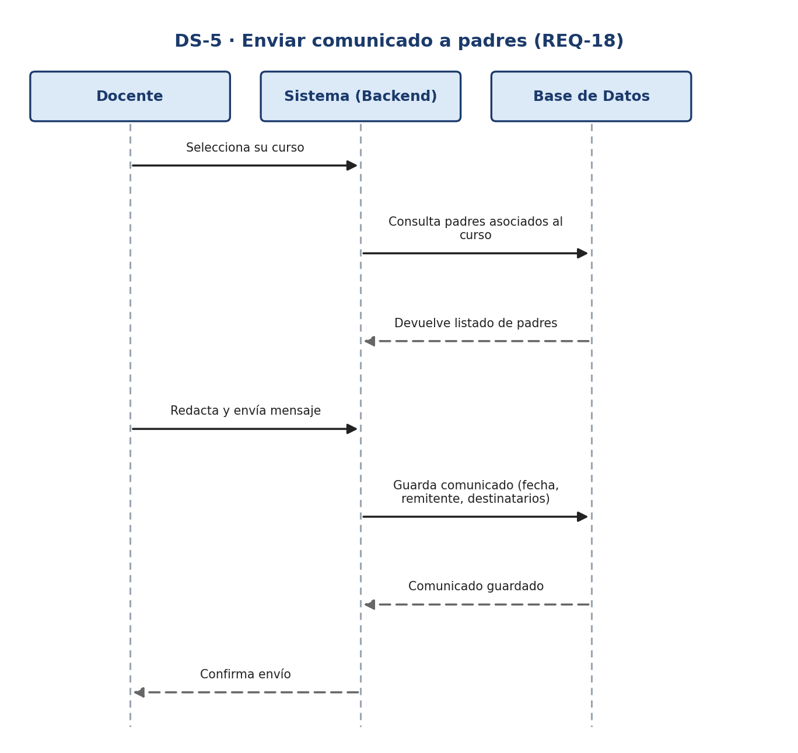
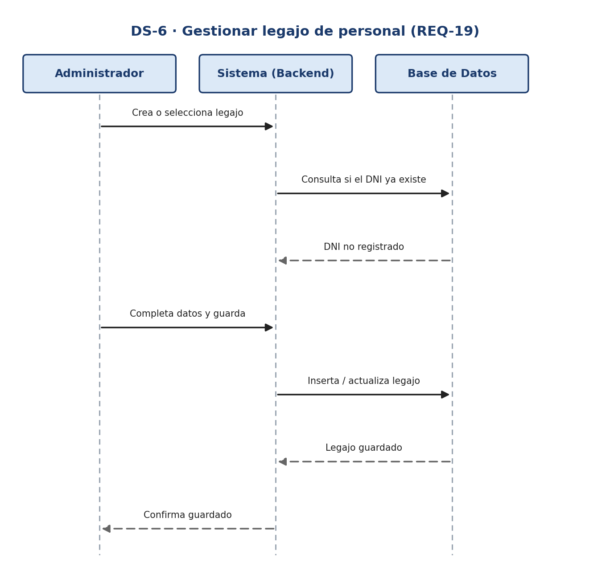

# Trabajo Práctico N° 1 — Parte 1

**Requerimientos, clasificación del SI, arquitecturas, Historias de Usuario, Casos de Uso y Diagramas de Secuencia**

Metodología de Sistemas II · UTN FRRe · TUP 2026
Centro Educativo *"Educar para Transformar"*
Integrantes: Cerqueiro, Gonzalo — Fernández, Lautaro

---

## Consignas

**a)** Formar los nuevos equipos de trabajo → equipo de dos integrantes: Cerqueiro, Gonzalo y
Fernández, Lautaro.

**b)** Considerando los requerimientos del Sistema de Gestión:

- Especificar las funcionalidades del sistema de información teniendo en cuenta las estrategias
  y objetivos organizacionales, aplicando la teoría de requerimientos.
- Clasificar el sistema de información de acuerdo a las funcionalidades identificadas.
- Describir la arquitectura de la información y la arquitectura de software adecuadas.
- Cada integrante selecciona tres requerimientos funcionales y desarrolla sus Historias de
  Usuario, Casos de Uso y Diagramas de Secuencia.

---

## 1. Teoría de requerimientos aplicada

Para redactar cada requerimiento funcional del Sistema de Gestión se aplicaron las siete
propiedades que debe cumplir todo requerimiento bien escrito:

| Propiedad | Qué significa |
|---|---|
| **Necesario** | El requerimiento responde a una necesidad real del negocio o del usuario; si se quita, el sistema pierde valor. |
| **Verificable** | Se puede comprobar objetivamente (con una prueba, inspección o demostración) si el requerimiento se cumplió o no. |
| **Consistente** | No contradice a ningún otro requerimiento del mismo sistema. |
| **Trazable** | Se puede vincular a su origen (objetivo institucional, stakeholder) y a los elementos de diseño y prueba que lo implementan. |
| **No ambiguo** | Tiene una única interpretación posible para todos los involucrados (usuarios, analistas, programadores). |
| **Conciso** | Está redactado de forma clara y breve, sin información innecesaria ni redundante. |
| **Completo** | Contiene toda la información necesaria (qué, quién, cuándo, con qué datos) sin dejar huecos que obliguen a suponer. |

Estas propiedades son las mismas utilizadas para verificar los requerimientos de la Actividad 1
(parte web) y se aplicaron también a los requerimientos del Sistema de Gestión detallados en la
sección 2: cada uno fue redactado de forma que resulte necesario, verificable, consistente,
trazable a un objetivo institucional, no ambiguo, conciso y completo.

---

## 2. Funcionalidades del Sistema de Gestión (requerimientos funcionales)

Requerimientos identificados a partir de las estrategias y objetivos de la institución
(agilizar trámites, dar seguimiento académico, mejorar la comunicación con las familias,
profesionalizar la gestión de personal y sostener la toma de decisiones de la Dirección).
La numeración continúa la de la Actividad 1 (REQ-01 a REQ-12, correspondientes a la parte web).

### REQ-13 — Gestión de matrícula y legajo del estudiante *(ADICIONAL)*

El sistema deberá permitir que el rol **Administrador** convierta una solicitud de inscripción
aprobada (REQ-07) en una matrícula oficial, generando un legajo digital del estudiante con sus
datos personales, nivel, curso asignado y documentación adjunta.

- **Funcionalidad:** Gestión de matrículas — Módulo Administrador
- **Objetivo institucional que apoya:** agilizar el trámite de inscripción y mantener
  actualizada la trayectoria escolar del alumno.

### REQ-14 — Gestión de cursos, materias y asignación docente

El sistema deberá permitir al **Administrador** crear cursos y divisiones por nivel educativo,
asociar materias a cada curso y asignar un Docente responsable a cada materia.

- **Funcionalidad:** Gestión de cursos — Módulo Administrador
- **Objetivo institucional que apoya:** organizar la oferta académica y la asignación de
  responsabilidades docentes.

### REQ-15 — Carga de calificaciones

El sistema deberá permitir que el **Docente** cargue calificaciones de sus alumnos por materia
y período, calculando automáticamente el promedio del período.

- **Funcionalidad:** Calificaciones — Módulo Docente
- **Objetivo institucional que apoya:** garantizar el seguimiento académico y la comunicación
  del rendimiento de los alumnos.

### REQ-16 — Registro de asistencia

El sistema deberá permitir que el **Docente** registre la asistencia diaria de los alumnos de
su curso, visible luego para Padre y Estudiante.

- **Funcionalidad:** Asistencia — Módulo Docente
- **Objetivo institucional que apoya:** detectar tempranamente situaciones de riesgo escolar
  por inasistencias.

### REQ-17 — Generación de boletines y constancias

El sistema deberá generar automáticamente el boletín de calificaciones por alumno y período, y
constancias de alumno regular descargables en PDF.

- **Funcionalidad:** Trámites — Módulo Alumno
- **Objetivo institucional que apoya:** reducir los tiempos administrativos en la emisión de
  documentación oficial.

### REQ-18 — Comunicaciones internas entre roles *(ADICIONAL)*

El sistema deberá permitir el envío de comunicados entre roles (Administrador/Autoridad hacia
Docentes, Personal, Padres y Estudiantes) y del Docente hacia los padres de su curso, quedando
registrados con fecha y remitente.

- **Funcionalidad:** Foro — Todos los módulos
- **Objetivo institucional que apoya:** fortalecer el vínculo institución-familia con
  comunicación directa y trazable.

### REQ-19 — Gestión de personal (RRHH)

El sistema deberá permitir al **Administrador** gestionar los legajos del personal docente y no
docente: contacto, función, curso/área asignada y estado (activo/inactivo).

- **Funcionalidad:** Gestión de personal — Módulo Administrador
- **Objetivo institucional que apoya:** profesionalizar la gestión del personal docente y no
  docente.

### REQ-20 — Gestión de postulaciones laborales

El sistema deberá permitir visualizar las postulaciones recibidas por búsqueda laboral (REQ-08)
y cambiar su estado (recibida, en revisión, entrevista, contratado, descartado).

- **Funcionalidad:** Postulaciones laborales — Módulo Administrador
- **Objetivo institucional que apoya:** optimizar el proceso de selección de personal.

### REQ-21 — Reportes y estadísticas para la Autoridad

El sistema deberá proveer al rol **Autoridad** reportes de matrícula por nivel/curso,
porcentaje de asistencia y rendimiento académico promedio, filtrables por período.

- **Funcionalidad:** Reportes gerenciales
- **Objetivo institucional que apoya:** brindar información oportuna para la toma de decisiones
  estratégicas de la Dirección.

### REQ-22 — Auditoría y trazabilidad de acciones

El sistema deberá registrar un historial de las acciones críticas de **Administrador** y
**Autoridad** (altas/bajas de usuarios, cambios de notas, aprobación de matrículas) con usuario,
fecha y acción.

- **Funcionalidad:** Auditoría — transversal a todos los módulos
- **Objetivo institucional que apoya:** garantizar la seguridad, la trazabilidad y la
  transparencia administrativa.

---

## 3. Clasificación del Sistema de Información

Según la teoría de tipos de Sistemas de Información, un SI puede clasificarse como **SI de
Apoyo a las Operaciones** (procesamiento de transacciones, control de procesos, colaboración
empresarial) o como **SI de Apoyo Gerencial** (SI gerencial, de apoyo a las decisiones y
ejecutivos). Aplicando esta clasificación a cada requerimiento:

| Requerimiento | Grupo | Tipo específico |
|---|---|---|
| REQ-13 — Matrícula | SI Apoyo a las Operaciones | Procesamiento de Transacciones (TPS) |
| REQ-14 — Cursos y docentes | SI Apoyo a las Operaciones | Control de Procesos |
| REQ-15 — Calificaciones | SI Apoyo a las Operaciones | Procesamiento de Transacciones (TPS) |
| REQ-16 — Asistencia | SI Apoyo a las Operaciones | Procesamiento de Transacciones (TPS) |
| REQ-17 — Boletines/constancias | SI Apoyo a las Operaciones | Colaboración Empresarial (KWS/OAS) |
| REQ-18 — Comunicaciones | SI Apoyo a las Operaciones | Colaboración Empresarial (OAS) |
| REQ-19 — Personal (RRHH) | SI Apoyo a las Operaciones | Procesamiento de Transacciones (TPS) |
| REQ-20 — Postulaciones | SI Apoyo a las Operaciones | Procesamiento de Transacciones (TPS) |
| REQ-21 — Reportes Autoridad | **SI Apoyo Gerencial** | SI Gerencial / Apoyo a las Decisiones (MIS/DSS) |
| REQ-22 — Auditoría | SI Apoyo a las Operaciones | Control de Procesos (seguridad transversal) |

### Clasificación general del sistema

El Sistema de Gestión es, en su mayor parte, un **SI de Apoyo a las Operaciones**: la mayoría
de los requerimientos (matrícula, cursos, notas, asistencia, personal, postulaciones,
auditoría) son transacciones cotidianas de nivel operativo (TPS), y las comunicaciones y la
documentación (boletines, constancias, mensajería) funcionan como sistemas de colaboración y de
oficina (KWS/OAS).

A la vez, incorpora un componente de **SI de Apoyo Gerencial** a través de REQ-21 (reportes
para la Autoridad), que consolida los datos operativos en información de nivel de gestión y
estratégico (MIS/DSS) para la toma de decisiones institucionales.

---

## 4. Arquitectura de la Información

La arquitectura de la información organiza las funcionalidades del Sistema de Gestión según el
nivel de la organización al que sirven, siguiendo la pirámide de sistemas (nivel operativo, de
conocimiento, de gestión y estratégico) vista en la Unidad 1:

| Capa | Función que agrupa | Requerimientos |
|---|---|---|
| Sistemas Estratégicos (ESS) | Reportes institucionales para la Autoridad | REQ-21 |
| Sistemas Administrativos (MIS) | Gestión de personal y postulaciones laborales | REQ-19, REQ-20 |
| Sistemas de Conocimiento (KWS/OAS) | Boletines, constancias, comunicaciones internas | REQ-17, REQ-18 |
| Sistemas Operativos (TPS) | Matrícula, cursos/materias, calificaciones, asistencia, auditoría | REQ-13, REQ-14, REQ-15, REQ-16, REQ-22 |

Esta organización en capas asegura que la información se genera una sola vez en el nivel
operativo (matrícula, notas, asistencia) y se reutiliza —filtrada, condensada y analizada— en
los niveles superiores, evitando la doble carga de datos.

---

## 5. Arquitectura de Software

Se propone una **arquitectura cliente-servidor en capas (*three-tier*)**, coherente con el requerimiento de
seguridad por roles ya definido (REQ-05, REQ-12):

| Capa | Responsabilidad | Tecnología |
|---|---|---|
| Presentación | Interfaz web responsive consumida por cada rol según su perfil (Administrador, Autoridad, Docente, Personal, Padre, Estudiante). | Aplicación web (frontend), publicada en Netlify |
| Aplicación / lógica de negocio | Reglas de negocio, autenticación y autorización por rol. | API / Backend as a Service (Supabase) |
| Datos | Almacenamiento persistente con políticas de seguridad a nivel de fila para que cada rol acceda solo a lo que le corresponde. | Base de datos relacional con Row Level Security (Supabase) |
| Infraestructura | Hosting, redes y seguridad de transporte (HTTPS). | Servicios cloud |

El detalle de los principios aplicados, los componentes funcionales, las restricciones y los
conectores está desarrollado en el
[plan de trabajo, apartado 1.5](../../00-equipo/plan-de-trabajo.md).

---

## 6. Historias de Usuario y Casos de Uso

Se seleccionaron **tres requerimientos funcionales por integrante** del Sistema de Gestión y se
desarrollaron sus Historias de Usuario y sus Casos de Uso correspondientes.

### Integrante: Cerqueiro, Gonzalo

#### Historia de Usuario N° 1

| Campo | Valor |
|---|---|
| Usuario | Administrador |
| Programador responsable | Gonzalo Cerqueiro |
| Nombre historia | Matricular alumno desde solicitud aprobada |
| Prioridad en negocio | Alta |
| Riesgo en desarrollo | Medio |
| Puntos estimados | 8 |
| Iteración asignada | Sprint 1 |

**Descripción:** Como Administrador quiero convertir una solicitud de inscripción aprobada en
una matrícula oficial, para generar el legajo digital del estudiante y asignarlo a un curso.

**Validación:** El Administrador puede transformar cualquier solicitud en estado "aprobada" en
una matrícula, y el sistema genera automáticamente el legajo con el curso asignado.

#### Caso de Uso N° 1 — Matricular alumno

| Campo | Valor |
|---|---|
| Actor(es) | Administrador |
| Req. relacionado | REQ-13 |
| Precondiciones | Existe una solicitud de inscripción en estado "aprobada". |

**Flujo normal:**
1. El Administrador accede al panel de solicitudes aprobadas.
2. Selecciona una solicitud.
3. El sistema muestra los datos del solicitante.
4. El Administrador asigna curso/división.
5. El Administrador confirma la matrícula.
6. El sistema genera el legajo digital y cambia el estado a "matriculado".

**Flujos alternativos:** si faltan datos obligatorios, el sistema solicita completarlos antes de
confirmar la matrícula.

**Postcondiciones:** el alumno queda matriculado y su legajo disponible en el sistema.

---

#### Historia de Usuario N° 2

| Campo | Valor |
|---|---|
| Usuario | Docente |
| Programador responsable | Gonzalo Cerqueiro |
| Nombre historia | Cargar calificaciones de alumnos |
| Prioridad en negocio | Alta |
| Riesgo en desarrollo | Bajo |
| Puntos estimados | 5 |
| Iteración asignada | Sprint 1 |

**Descripción:** Como Docente quiero cargar las calificaciones de mis alumnos por materia y
período, para que el sistema calcule el promedio automáticamente.

**Validación:** Solo el Docente titular de la materia puede cargar o editar notas de su curso;
el sistema calcula el promedio al guardar.

#### Caso de Uso N° 2 — Cargar calificaciones

| Campo | Valor |
|---|---|
| Actor(es) | Docente |
| Req. relacionado | REQ-15 |
| Precondiciones | El Docente está autenticado y asignado a la materia/curso correspondiente. |

**Flujo normal:**
1. El Docente selecciona curso y materia.
2. El sistema muestra el listado de alumnos.
3. El Docente ingresa la nota de cada alumno.
4. El Docente guarda los cambios.
5. El sistema calcula el promedio del período.

**Flujos alternativos:** si la nota ingresada está fuera del rango válido, el sistema rechaza el
valor y solicita su corrección.

**Postcondiciones:** las notas quedan guardadas y el promedio del período actualizado.

---

#### Historia de Usuario N° 3

| Campo | Valor |
|---|---|
| Usuario | Autoridad |
| Programador responsable | Gonzalo Cerqueiro |
| Nombre historia | Consultar indicadores institucionales |
| Prioridad en negocio | Media |
| Riesgo en desarrollo | Medio |
| Puntos estimados | 8 |
| Iteración asignada | Sprint 2 |

**Descripción:** Como Autoridad quiero visualizar reportes de matrícula, asistencia y
rendimiento académico filtrados por período, para tomar decisiones institucionales.

**Validación:** El reporte se actualiza según el período seleccionado y los datos son
consistentes con matrícula, asistencia y notas cargadas.

#### Caso de Uso N° 3 — Consultar indicadores institucionales

| Campo | Valor |
|---|---|
| Actor(es) | Autoridad |
| Req. relacionado | REQ-21 |
| Precondiciones | La Autoridad está autenticada con permisos de acceso a reportes. |

**Flujo normal:**
1. La Autoridad accede al módulo de reportes.
2. Selecciona el período y el tipo de indicador.
3. El sistema procesa los datos de matrícula, asistencia y notas.
4. El sistema muestra el reporte resultante.

**Flujos alternativos:** si no hay datos cargados para el período elegido, el sistema informa
"sin datos disponibles".

**Postcondiciones:** el reporte queda visualizado en pantalla y disponible para exportar a PDF.

---

### Integrante: Fernández, Lautaro

#### Historia de Usuario N° 4

| Campo | Valor |
|---|---|
| Usuario | Docente |
| Programador responsable | Lautaro Fernández |
| Nombre historia | Registrar asistencia diaria |
| Prioridad en negocio | Alta |
| Riesgo en desarrollo | Bajo |
| Puntos estimados | 3 |
| Iteración asignada | Sprint 1 |

**Descripción:** Como Docente quiero registrar la asistencia diaria de los alumnos de mi curso,
para llevar un control actualizado de inasistencias.

**Validación:** El Docente puede marcar presente/ausente por alumno y día; el registro queda
disponible para consulta de Padre y Estudiante.

#### Caso de Uso N° 4 — Registrar asistencia diaria

| Campo | Valor |
|---|---|
| Actor(es) | Docente |
| Req. relacionado | REQ-16 |
| Precondiciones | El Docente está autenticado y el curso tiene alumnos matriculados. |

**Flujo normal:**
1. El Docente selecciona curso y fecha.
2. El sistema muestra el listado de alumnos.
3. El Docente marca presente/ausente por alumno.
4. El Docente guarda el registro.

**Flujos alternativos:** si ya existe asistencia cargada para esa fecha, el sistema permite
editarla en lugar de duplicarla.

**Postcondiciones:** la asistencia del día queda registrada y disponible para consulta de Padre
y Estudiante.

---

#### Historia de Usuario N° 5

| Campo | Valor |
|---|---|
| Usuario | Docente |
| Programador responsable | Lautaro Fernández |
| Nombre historia | Enviar comunicado a padres del curso |
| Prioridad en negocio | Media |
| Riesgo en desarrollo | Bajo |
| Puntos estimados | 2 |
| Iteración asignada | Sprint 2 |

**Descripción:** Como Docente quiero enviar un mensaje a los padres de mi curso, para
informarles novedades sin depender del papel.

**Validación:** El mensaje llega a todos los padres asociados al curso y queda registrado con
fecha y remitente.

#### Caso de Uso N° 5 — Enviar comunicado a padres

| Campo | Valor |
|---|---|
| Actor(es) | Docente |
| Req. relacionado | REQ-18 |
| Precondiciones | El Docente está autenticado y asignado al curso. |

**Flujo normal:**
1. El Docente accede al módulo de comunicaciones.
2. Selecciona su curso.
3. Redacta el mensaje.
4. Envía el comunicado.

**Flujos alternativos:** si el mensaje queda vacío, el sistema no permite el envío.

**Postcondiciones:** el mensaje queda visible para los padres del curso, con fecha y remitente
registrados.

---

#### Historia de Usuario N° 6

| Campo | Valor |
|---|---|
| Usuario | Administrador |
| Programador responsable | Lautaro Fernández |
| Nombre historia | Gestionar legajo de personal |
| Prioridad en negocio | Media |
| Riesgo en desarrollo | Medio |
| Puntos estimados | 5 |
| Iteración asignada | Sprint 2 |

**Descripción:** Como Administrador quiero gestionar el legajo del personal docente y no
docente, para mantener actualizados sus datos y estado laboral.

**Validación:** El Administrador puede crear, editar y dar de baja legajos de personal, y el
estado (activo/inactivo) se refleja en los accesos al sistema.

#### Caso de Uso N° 6 — Gestionar legajo de personal

| Campo | Valor |
|---|---|
| Actor(es) | Administrador |
| Req. relacionado | REQ-19 |
| Precondiciones | El Administrador está autenticado. |

**Flujo normal:**
1. El Administrador accede al módulo de personal.
2. Crea o selecciona un legajo existente.
3. Completa o edita los datos (contacto, función, estado).
4. Guarda los cambios.

**Flujos alternativos:** si el DNI ingresado ya existe, el sistema no permite duplicar el legajo.

**Postcondiciones:** el legajo de personal queda creado o actualizado, reflejando su estado
activo/inactivo.

---

## 7. Diagramas de Secuencia

Cada diagrama muestra la interacción entre el actor, el Sistema (Backend) y la Base de Datos,
siguiendo el mismo flujo normal descrito en el Caso de Uso correspondiente. Las flechas
continuas representan solicitudes; las flechas punteadas, las respuestas.

### DS-1 — Caso de Uso N° 1 · Matricular alumno (REQ-13)

### DS-2 — Caso de Uso N° 2 · Cargar calificaciones (REQ-15)

### DS-3 — Caso de Uso N° 3 · Consultar indicadores institucionales (REQ-21)

### DS-4 — Caso de Uso N° 4 · Registrar asistencia diaria (REQ-16)

### DS-5 — Caso de Uso N° 5 · Enviar comunicado a padres (REQ-18)

### DS-6 — Caso de Uso N° 6 · Gestionar legajo de personal (REQ-19)

---

## Trazabilidad

| HU | Req. | Caso de Uso | Diagrama | Responsable | Sprint |
|---|---|---|---|---|---|
| HU1 | REQ-13 | CU-1 | DS-1 | Gonzalo Cerqueiro | 1 |
| HU2 | REQ-15 | CU-2 | DS-2 | Gonzalo Cerqueiro | 1 |
| HU3 | REQ-21 | CU-3 | DS-3 | Gonzalo Cerqueiro | 2 |
| HU4 | REQ-16 | CU-4 | DS-4 | Lautaro Fernández | 1 |
| HU5 | REQ-18 | CU-5 | DS-5 | Lautaro Fernández | 2 |
| HU6 | REQ-19 | CU-6 | DS-6 | Lautaro Fernández | 2 |
