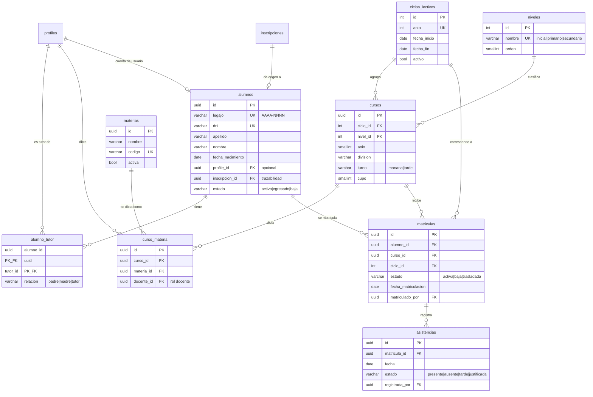

# Modelado del Sistema de Gestión — Sprint 1

Metodología de Sistemas II · UTN FRRe · TUP 2026
Centro Educativo *"Educar para Transformar"* — **Grupo 4**
Integrantes: Cerqueiro, Gonzalo — Fernández, Lautaro

> Etapa 3 del cronograma (08/09 al 17/09). Modela lo que necesita el **Sprint 1**:
> REQ-14 (cursos, materias y asignación docente), HU1 (matrícula y legajo) y
> HU4 (asistencia diaria). El script está en
> [`docs/supabase-gestion.sql`](../../supabase-gestion.sql).

---

## 1. Alcance

El esquema de la Parte 1 tiene ocho tablas, todas de la web institucional:
`profiles`, `noticias`, `opiniones`, `inscripciones`, `galeria_categorias`,
`galeria`, `empleos` y `contacto_mensajes`. **Ninguna corresponde al Sistema de
Gestión**, así que las seis Historias de Usuario no tenían dónde apoyarse.

Este modelado agrega **nueve tablas**. No cubre todavía deportes, transporte ni
comedor: esos entran con las HU de los sprints siguientes, y modelarlos ahora
sería adelantar decisiones sin un requerimiento que las valide.

| Tabla | Para qué | Requerimiento |
|---|---|---|
| `ciclos_lectivos` | El año escolar del que cuelga la matrícula | Base |
| `niveles` | Inicial, primario y secundario | Base |
| `cursos` | Nivel + año + división + turno, dentro de un ciclo | REQ-14 |
| `materias` | Catálogo de materias | REQ-14 |
| `curso_materia` | La materia dictada en un curso, con su docente | REQ-14 |
| `alumnos` | Legajo digital del estudiante | HU1 · REQ-13 |
| `alumno_tutor` | Vínculo entre el alumno y quienes lo tienen a cargo | HU1 · regla del enunciado |
| `matriculas` | Ubica al alumno en un curso para un ciclo | HU1 · REQ-13 |
| `asistencias` | Registro diario por alumno | HU4 · REQ-16 |

---

## 2. Diagrama entidad-relación

---

## 3. Cómo se cumplen las reglas del enunciado

El enunciado impone restricciones que **se resuelven en el modelo**, no en la
interfaz. Ponerlas en la base garantiza que se cumplan aunque la aplicación
tenga un error.

| Regla del enunciado | Cómo se garantiza |
|---|---|
| Cada alumno pertenece a un único curso | `UNIQUE (alumno_id, ciclo_id)` en `matriculas`. Un alumno no puede tener dos matrículas en el mismo ciclo. |
| Cada curso pertenece a un único nivel | `cursos.nivel_id` es una clave foránea simple, no una tabla intermedia. |
| Una materia puede dictarse en distintos cursos y tener distinto profesor según el curso | El docente se asigna en `curso_materia`, no en `materias`. La misma materia aparece en varios cursos con docentes distintos. |
| Evitar inscripciones duplicadas | `UNIQUE (curso_id, materia_id)` en `curso_materia`, `UNIQUE (alumno_id, ciclo_id)` en `matriculas` y `UNIQUE (matricula_id, fecha)` en `asistencias`. |
| Un padre solo consulta y gestiona a sus hijos | `alumno_tutor` define el vínculo y la función `alumnos_a_cargo()` lo aplica en las políticas RLS de `alumnos`, `matriculas` y `asistencias`. |

Además, dos reglas que no están en el enunciado pero que los criterios de
aceptación exigen:

| Criterio | Cómo se garantiza |
|---|---|
| HU1 — "la solicitud queda en estado *matriculado* y no puede duplicarse" | Se amplió el `CHECK` de `inscripciones.estado` para incluir `matriculada`, y `alumnos.inscripcion_id` es `UNIQUE`: una solicitud no puede generar dos alumnos. |
| HU4 — "si la fecha ya fue cargada, se edita en lugar de duplicarse" | `UNIQUE (matricula_id, fecha)` en `asistencias`. |

---

## 4. Reglas implementadas con disparadores

Tres reglas no se pueden expresar con una restricción declarativa y se
resolvieron con *triggers*:

| Disparador | Qué valida |
|---|---|
| `trg_validar_docente` | Que el docente asignado a una materia exista, tenga rol `docente` y esté activo. |
| `trg_validar_cupo` | Que la matrícula no supere el cupo del curso. |
| `trg_generar_legajo` | Genera el número de legajo correlativo con formato `AAAA-NNNN` (ej. `2027-0001`). |

> **Nota sobre la asistencia.** La validación de que la fecha no sea futura se
> dejó fuera del modelo: PostgreSQL no admite `CURRENT_DATE` en un `CHECK`
> porque no es una función inmutable. Se valida en la capa de servicios.

---

## 5. Seguridad por rol

Las políticas RLS cubren los seis roles del sistema. La lógica se apoya en tres
funciones auxiliares, por la misma razón por la que en el frontend la
verificación de permisos vive en `tienePermiso()`: **la regla se escribe una
sola vez**.

| Función | Devuelve |
|---|---|
| `rol_actual()` | El rol del usuario autenticado |
| `tiene_rol(VARIADIC roles)` | Si el usuario tiene alguno de los roles indicados |
| `alumnos_a_cargo()` | Los alumnos de los que el usuario es tutor |

Las tres son `SECURITY DEFINER`, lo que evita la recursión infinita que se
produce al consultar `profiles` desde una política aplicada sobre `profiles`.

| Tabla | Administración | Docente | Personal | Padre / Estudiante |
|---|---|---|---|---|
| Catálogos (ciclos, niveles, cursos, materias, `curso_materia`) | Todo | Lectura | Lectura | Lectura |
| `alumnos` | Todo | Lectura | Lectura | Solo los propios |
| `alumno_tutor` | Todo | Lectura | Lectura | Solo los propios |
| `matriculas` | Todo | Lectura | Lectura | Solo los de sus hijos |
| `asistencias` | Todo | Carga y edita **solo sus cursos** | Lectura | Solo los de sus hijos |

---

## 6. Verificación

El script no se ejecutó todavía contra la base de Supabase. Lo que sí se
verificó localmente:

- **Sintaxis:** el archivo se parseó con `pglast`, que usa el analizador real de
  PostgreSQL (`libpg_query`). Las **101 sentencias** se aceptan sin error.
- **Orden de dependencias:** toda clave foránea apunta a una tabla creada antes,
  y las tres funciones se definen antes de las políticas que las usan.
- **Idempotencia:** todo usa `IF NOT EXISTS`, `CREATE OR REPLACE` o un
  `DROP ... IF EXISTS` previo, de modo que el script puede correrse más de una vez.

Queda pendiente ejecutarlo en Supabase y cargar datos de prueba.

---

## 7. Qué falta para completar el Sprint 1

- [x] Modelado de cursos, materias, matrícula, legajo y asistencia
- [ ] Ejecutar el script en Supabase y verificar las políticas con cada rol
- [ ] Capa de servicios (patrón **Facade**) sobre estas tablas
- [ ] HU1 — listado de solicitudes aprobadas y asignación de curso
- [ ] HU4 — carga de asistencia diaria
