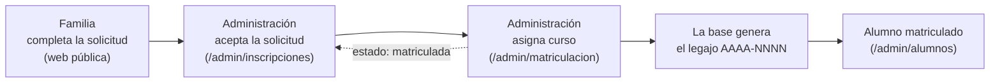

# Módulo Administrador — Sprint 1

Metodología de Sistemas II · UTN FRRe · TUP 2026
Centro Educativo *"Educar para Transformar"* — **Grupo 4**
Integrantes: Cerqueiro, Gonzalo — Fernández, Lautaro

> Primer módulo del Sistema de Gestión terminado de punta a punta.
> Cubre **HU1** (matricular alumno desde solicitud aprobada, REQ-13) y
> **REQ-14** (cursos, materias y asignación docente), sobre el modelo descrito
> en [`docs/02-unidad-2/01-modelado/README.md`](../01-modelado/README.md).

---

## 1. Por qué el módulo Administrador primero

De los tres módulos posibles —Alumnos, Profesores y Administrador— el único que
puede terminarse sin depender de los otros es el de Administración:

| Módulo | Qué necesita para existir |
|---|---|
| Administrador | Solo el modelo de datos. **Ya se puede completar.** |
| Profesores | Cursos creados y docentes asignados, es decir REQ-14, que es parte del módulo Administrador. |
| Alumnos | Alumnos matriculados, es decir HU1, que es parte del módulo Administrador. |

Además, el panel de administración de la Parte 1 ya aporta el layout, el menú,
la tabla de datos y los modales, de modo que el esfuerzo se concentró en la
lógica del negocio y no en volver a construir la interfaz.

---

## 2. Qué se puede hacer

| Pantalla | Ruta | Qué resuelve |
|---|---|---|
| **Matriculación** | `/admin/matriculacion` | Lista las solicitudes aprobadas, asigna curso y genera el legajo. HU1. |
| **Alumnos** | `/admin/alumnos` | Legajos del ciclo, búsqueda por apellido, DNI o legajo, tutores vinculados y baja de matrícula. |
| **Cursos y materias** | `/admin/cursos` | ABM de cursos con cupo y ocupación, ABM de materias y asignación de docente por curso. REQ-14. |

### Circuito completo

---

## 3. Criterios de aceptación de HU1

| Criterio | Cómo se cumple | Dónde |
|---|---|---|
| Solicitud aprobada + curso asignado → matrícula confirmada y legajo generado | El disparador `trg_generar_legajo` numera el legajo como `AAAA-NNNN`; la pantalla lo muestra al confirmar. | `matricula.matricularDesdeSolicitud()` |
| Faltan datos obligatorios → el sistema los solicita y no confirma | Se validan apellido, nombre, DNI, fecha de nacimiento y curso antes de enviar nada. | `MatriculacionAdminPage.confirmarMatricula()` |
| La solicitud queda en "matriculada" y no puede duplicarse | La solicitud cambia de estado y `alumnos.inscripcion_id` es único: una solicitud no puede generar dos alumnos. | `docs/supabase-gestion.sql` |
| Solo Administración accede al panel de matriculación | Ruta protegida por rol + políticas RLS sobre `alumnos` y `matriculas`. | `App.jsx`, `roles.js`, RLS |

Reglas que además aplica la base durante la matriculación:

- **Cupo del curso.** Si el curso está completo, `trg_validar_cupo` rechaza la
  operación y la pantalla muestra el mensaje. En el selector, los cursos
  completos aparecen deshabilitados.
- **Un curso por ciclo.** `UNIQUE (alumno_id, ciclo_id)` impide matricular dos
  veces al mismo alumno en el mismo año.
- **DNI único.** Si el alumno ya tiene legajo, la base lo rechaza.

---

## 4. Patrón de diseño del sprint: Facade

La capa de servicios vive en [`src/services/`](../../../src/services) y es la
única puerta de entrada a la base de datos para las pantallas nuevas.

| Archivo | Responsabilidad |
|---|---|
| `base.js` | Ejecuta las consultas, registra el error técnico y traduce el error de PostgreSQL a un mensaje en castellano. |
| `academico.js` | Ciclos, niveles, cursos, materias y asignación de docentes. |
| `matricula.js` | Solicitudes, alumnos, tutores y el circuito de matriculación. |
| `index.js` | Lo que importan las pantallas. |

Qué gana el proyecto:

1. **Las pantallas no conocen la base.** No aparece el nombre de ninguna tabla
   en los componentes; si cambia el modelo, se toca un solo archivo.
2. **Los errores dejan de perderse.** Antes varias consultas descartaban el
   `error` en silencio y la pantalla quedaba vacía sin explicación. Ahora todo
   error se registra en consola y se muestra redactado.
3. **Las reglas se escriben una sola vez.** Las restricciones y disparadores
   viven en la base; el servicio solo traduce lo que la base responde.

> Las páginas de la Parte 1 todavía consultan Supabase directamente. Se migran
> en el Sprint 2, para no tocar en este sprint código que ya funciona y está
> entregado.

---

## 5. Seguridad en dos capas

| Capa | Dónde | Qué controla |
|---|---|---|
| Interfaz | `PERMISOS.MATRICULAR`, `GESTIONAR_ACADEMICO`, `VER_ALUMNOS` en `src/types/roles.js` y la ruta protegida en `App.jsx` | Que el menú y las pantallas no aparezcan para quien no corresponde. |
| Base de datos | Políticas RLS de `docs/supabase-gestion.sql` | Que un pedido directo a la API tampoco devuelva datos ajenos. |

Ambas listas dicen lo mismo: matricular y gestionar la estructura académica es
de **Administración y Autoridad**; Docente y Personal solo leen.

---

## 6. Cómo ponerlo en marcha

1. Supabase → **SQL Editor** → ejecutar [`docs/supabase-gestion.sql`](../../supabase-gestion.sql)
   (crea las nueve tablas, los disparadores y las políticas RLS).
2. Ejecutar [`docs/supabase-gestion-datos.sql`](../../supabase-gestion-datos.sql)
   (ciclo lectivo 2027, tres niveles, seis cursos, nueve materias y tres
   solicitudes de prueba ya aceptadas).
3. `npm run dev` → entrar con un usuario de rol `admin` → **Sistema de Gestión**
   en el menú lateral.

### Prueba de humo

| Paso | Resultado esperado |
|---|---|
| Matriculación → *Matricular* en una solicitud | Se abre el formulario con los datos de la solicitud ya cargados. |
| Confirmar sin elegir curso | No guarda y pide el curso. |
| Elegir curso y confirmar | Muestra el legajo generado, por ejemplo `2026-0001`. |
| Volver a la pestaña *Matriculadas* | La solicitud ya no aparece en "Para matricular". |
| Alumnos | El alumno figura con su legajo y su curso. |
| Cursos y materias → abrir un curso | La ocupación subió en uno. |

---

## 7. Qué falta

- [x] Modelado (etapa 3) y scripts SQL versionados
- [x] Capa de servicios — patrón Facade
- [x] HU1 — matriculación, legajo y cierre de la solicitud
- [x] REQ-14 — cursos, materias y asignación de docentes
- [ ] Ejecutar los scripts en Supabase y verificar las políticas con cada rol
- [ ] HU4 — carga de asistencia diaria (módulo Profesores, Lautaro)
- [ ] Migrar las pantallas de la Parte 1 a la capa de servicios (Sprint 2)
- [ ] Mover la matriculación a una función de PostgreSQL para que los tres
      pasos sean atómicos (hoy se compensa borrando el alumno si falla la matrícula)
